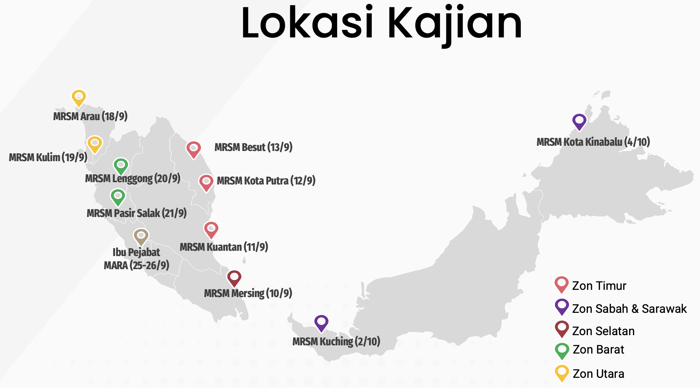

# Penyiasatan Tapak

<figure><figcaption>
Lokasi Kajian
</figcaption></figure>

Penyiasatan tapak merujuk kepada aktiviti yang melibatkan MRSM berikut:

| Zon     | Name                                          | Programs Offered | Year Established |
| ------- | --------------------------------------------- | ---------------- | ---------------- |
| Utara   | [Arau](http://arau.mrsm.edu.my)               | Program Premier  | 2019             |
|         | [PDRM Kulim](http://pdrmkulim.mrsm.edu.my)    | Program Premier  | 1991             |
| Barat   | [Lenggong](http://lenggong.mrsm.edu.my)       | Program Premier  | 2001             |
|         | [Pasir Salak](http://psalak.mrsm.edu.my)      | Program Premier  | 2003             |
| Selatan | [Mersing](http://mersing.mrsm.edu.my)         | Program Premier  | 2001             |
| Timur   | [Kuantan](http://kuantan.mrsm.edu.my)         | IGCSE            | 1974             |
|         | [Kota Putra](http://kputra.mrsm.edu.my)       | Ulul Albab       | 1998             |
|         | [Besut](http://besut.mrsm.edu.my)             | Program Premier  | 2004             |
| Sarawak | [Kuching](http://kuching.mrsm.edu.my)         | IGCSE            | 1993             |
| Sabah   | [Kota Kinabalu](http://kkinabalu.mrsm.edu.my) | Program Premier  | 2002             |

### Aktiviti

i. Ekosistem infra di keseluruhan maktab

ii. Temubual bersama pengguna diperingkat MRSM, BPM dan stake holder

iii. Perkakasan ICT, server dan rangkaian di MRSM dan BPM.
