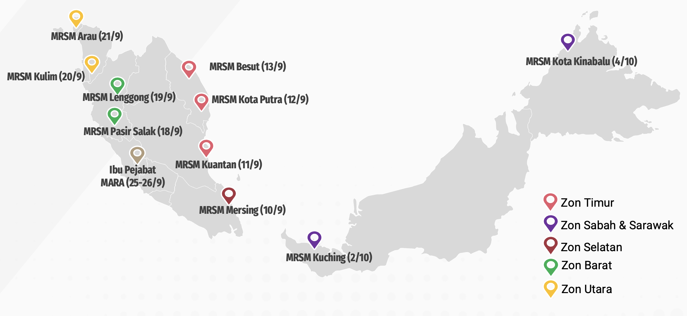

# 2⃣ Penyiasatan Tapak

<figure><figcaption></figcaption></figure>

<table><thead><tr><th width="137">Zon</th><th>Name</th><th width="181">Programs Offered</th><th width="171" align="center">Year Established</th><th align="center">Website</th></tr></thead><tbody><tr><td>Utara</td><td>Arau</td><td>Program Premier</td><td align="center">2019</td><td align="center"></td></tr><tr><td>Kedah</td><td>PDRM Kulim</td><td>Program Premier</td><td align="center">1991</td><td align="center"></td></tr><tr><td></td><td>Langkawi</td><td>IGCSE</td><td align="center">1999</td><td align="center"></td></tr><tr><td></td><td>Pendang</td><td>Program Premier</td><td align="center">2001</td><td align="center"></td></tr><tr><td></td><td>Kubang Pasu</td><td>IGCSE</td><td align="center">2007</td><td align="center"></td></tr><tr><td></td><td>Merbok</td><td>Program Premier</td><td align="center">2007</td><td align="center"></td></tr><tr><td></td><td>Baling</td><td>Program Premier</td><td align="center">2010</td><td align="center"></td></tr><tr><td>Pulau Pinang</td><td>Balik Pulau</td><td>IB MYP</td><td align="center">1982</td><td align="center"></td></tr><tr><td></td><td>Transkrian</td><td>Program Premier</td><td align="center">2002</td><td align="center"></td></tr><tr><td></td><td>Kepala Batas</td><td>Ulul Albab</td><td align="center">2007</td><td align="center"></td></tr><tr><td>Perak</td><td>Taiping</td><td>Program Bitara</td><td align="center">1982</td><td align="center"></td></tr><tr><td></td><td>Gerik</td><td>Program Premier</td><td align="center">1993</td><td align="center"></td></tr><tr><td></td><td>Lenggong</td><td>Program Premier</td><td align="center">2001</td><td align="center"></td></tr><tr><td></td><td>Pasir Salak</td><td>Program Premier</td><td align="center">2003</td><td align="center"></td></tr><tr><td></td><td>FELDA (Trolak)</td><td>Ulul Albab</td><td align="center">2008</td><td align="center"></td></tr><tr><td></td><td>Pengkalan Hulu</td><td>Program Premier</td><td align="center">2008</td><td align="center"></td></tr><tr><td></td><td>Parit</td><td>IGCSE</td><td align="center">2012</td><td align="center"></td></tr><tr><td></td><td>Sultan Azlan Shah</td><td>Program Premier</td><td align="center">2015</td><td align="center"></td></tr><tr><td></td><td>Bagan Datuk</td><td>Ulul Albab</td><td align="center">2021</td><td align="center"></td></tr><tr><td>Selangor</td><td>Kuala Kubu Bharu</td><td>IGCSE</td><td align="center">2002</td><td align="center"></td></tr><tr><td></td><td>Sungai Besar</td><td>Ulul Albab</td><td align="center">2016</td><td align="center"></td></tr><tr><td>Negeri Sembilan</td><td>Kuala Klawang</td><td>IGCSE</td><td align="center">1987</td><td align="center"></td></tr><tr><td></td><td>Serting</td><td>Program Premier</td><td align="center">1993</td><td align="center"></td></tr><tr><td></td><td>Gemencheh</td><td>Ulul Albab</td><td align="center">2007</td><td align="center"></td></tr><tr><td>Melaka</td><td>Tun Ghafar Baba</td><td>Program Bitara</td><td align="center">1981</td><td align="center"></td></tr><tr><td></td><td>Terendak</td><td>Program Premier</td><td align="center">1983</td><td align="center"></td></tr><tr><td></td><td>Alor Gajah</td><td>IGCSE</td><td align="center">2007</td><td align="center"></td></tr><tr><td>Johor</td><td>Muar</td><td>Program Premier</td><td align="center">1980</td><td align="center"></td></tr><tr><td></td><td>Mersing</td><td>Program Premier</td><td align="center">2001</td><td align="center"></td></tr><tr><td></td><td>Tun Dr Ismail</td><td>IB MYP</td><td align="center">2002</td><td align="center"></td></tr><tr><td></td><td>Batu Pahat</td><td>Program Premier</td><td align="center">2002</td><td align="center"></td></tr><tr><td></td><td>Johor Bahru</td><td>IGCSE</td><td align="center">2012</td><td align="center"></td></tr><tr><td>Pahang</td><td>Kuantan</td><td>IGCSE</td><td align="center">1974</td><td align="center"></td></tr><tr><td></td><td>Muadzam Shah</td><td>Program Premier</td><td align="center">1995</td><td align="center"></td></tr><tr><td></td><td>Tun Ghazali Shafie</td><td>Program Premier</td><td align="center">2002</td><td align="center"></td></tr><tr><td></td><td>Bentong</td><td>Teknikal</td><td align="center">2009</td><td align="center"></td></tr><tr><td></td><td>Tun Abdul Razak</td><td>IGCSE</td><td align="center">2010</td><td align="center"></td></tr><tr><td></td><td>ATM Bera</td><td>Ulul Albab</td><td align="center">2021</td><td align="center"></td></tr><tr><td>Terengganu</td><td>Kuala Terengganu</td><td>Program Premier</td><td align="center">1978</td><td align="center"></td></tr><tr><td></td><td>Kuala Berang</td><td>Program Premier</td><td align="center">1987</td><td align="center"></td></tr><tr><td></td><td>Kota Putra</td><td>Ulul Albab</td><td align="center">1998</td><td align="center"></td></tr><tr><td></td><td>Besut</td><td>Program Premier</td><td align="center">2004</td><td align="center"></td></tr><tr><td>Kelantan</td><td>Pengkalan Chepa</td><td>Program Bitara</td><td align="center">1973</td><td align="center"></td></tr><tr><td></td><td>Pasir Tumboh</td><td>Program Premier</td><td align="center">1987</td><td align="center"></td></tr><tr><td></td><td>Jeli</td><td>Program Premier</td><td align="center">2001</td><td align="center"></td></tr><tr><td></td><td>Kuala Krai</td><td>Program Premier</td><td align="center">2002</td><td align="center"></td></tr><tr><td></td><td>Tumpat</td><td>IGCSE</td><td align="center">2010</td><td align="center"></td></tr><tr><td>Sarawak</td><td>Kuching</td><td>IGCSE</td><td align="center">1993</td><td align="center"></td></tr><tr><td></td><td>Betong</td><td>Program Premier</td><td align="center">2009</td><td align="center"></td></tr><tr><td></td><td>Mukah</td><td>Program Premier</td><td align="center">2010</td><td align="center"></td></tr><tr><td>Sabah</td><td>Kota Kinabalu</td><td>Program Premier</td><td align="center">2002</td><td align="center"></td></tr><tr><td></td><td>Tun Mohammad Fuad Stephens</td><td>IB MYP</td><td align="center">2013</td><td align="center"></td></tr><tr><td></td><td>Semporna</td><td>Ulul Albab</td><td align="center">2017</td><td align="center"></td></tr></tbody></table>

Penyiasatan tapak merujuk kepada aktiviti yang melibatkan MRSM berikut:&#x20;

a. Zon Utara - MRSM Arau dan MRSM PDRM Kulim&#x20;

b. Zon Selatan - MRSM Mersing&#x20;

c. Zon Timur - MRSM Kuantan, MRSM Kota Putra dan MRSM Besut&#x20;

d. Zon Barat - MRSM Lenggong dan MRSM Pasir Salak&#x20;

e. Sabah - MRSM Kota Kinabalu&#x20;

f. Sarawak - MRSM Kuching

### Aktiviti

i. Ekosistem infra di keseluruhan maktab&#x20;

ii. Temubual bersama pengguna diperingkat MRSM, BPM dan stake holder&#x20;

iii. Perkakasan ICT, server dan rangkaian di MRSM dan BPM.
